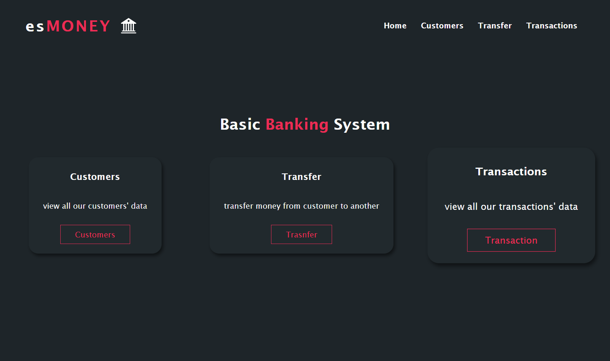
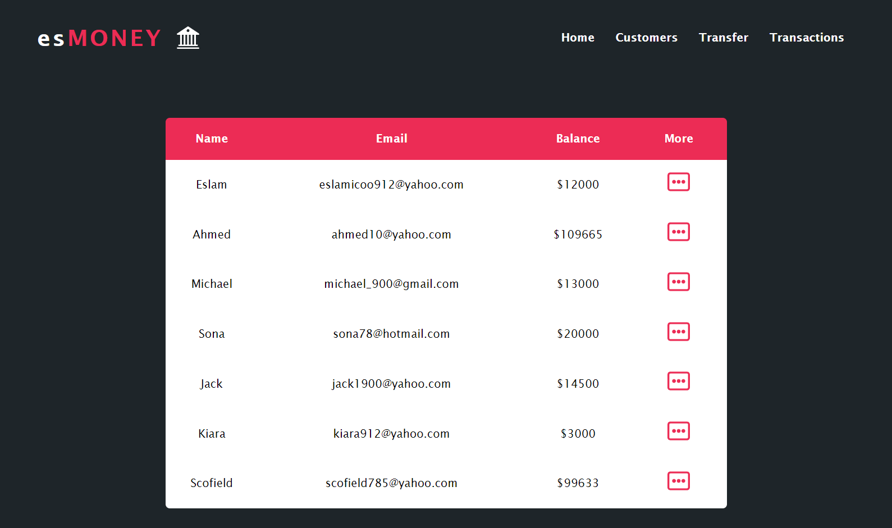
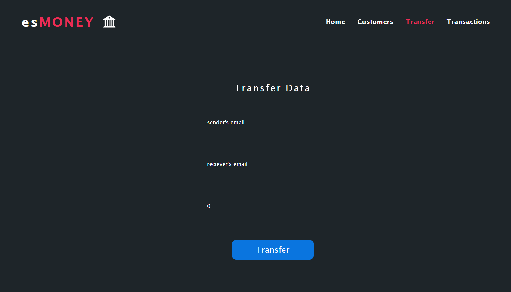
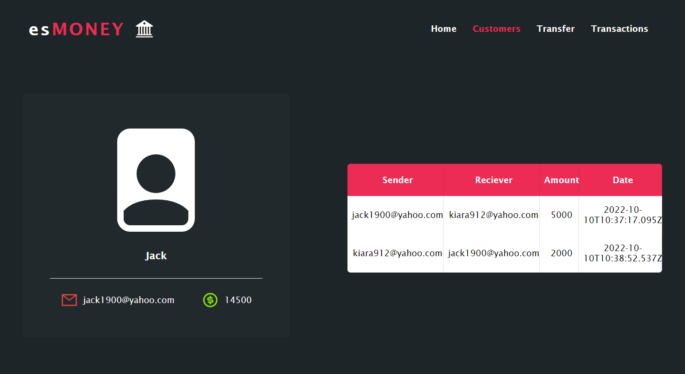

# Basic-Banking-System

Hello, friends! This is a **Dynamic Banking System** developed by **MERN** stack. This project is developed for a virtual internship progeam at **The-Sparks-Foundation**.

;

# Content

### Description
### Installation
### Usage

# Projetc Description
- This project is developed in two sections (backend and fronend).
- The backend is responsible for creating APIs, handling database, and running CRUD operations.
- The frontend section is used for rendering the APIs created by the backend and styling them to be displayed on the screen as HTML elements
- The main idea of the project is to transfer an amount of money from a client to another.
- Also you can browse a table of clients and all happened transactions

# Installation
This project is developed using Node.js and React.js .
You should have Node Package Manager ( npm ) installed on your device.
Once you downloaded the repo on your local machine, run the following commands
For server folder: `npm run start` to start the server.
For client folder: `npm start` to start react app.

# Usage
- The home page is containing three cards. They are customers, transfer, transactions.
- Click the customers card to go to the customers page in which you can see a table of customers.
- At the end of each customer row, there is an icon for reading more info about this customer.
- If you clicked this icon, a full page about this customer info and transactions will be displayed.
- Coming back to the home page, if you clicke the transfer card, you will be transfered to a page which you can transfer money from a client to anouther.
- The transactions card will transfer you to a page which contains a table of all transactions happend.
